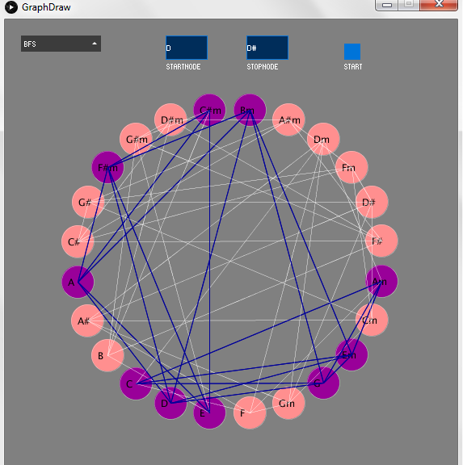

# Musical-Graph
GUI with Processing and ChucK

  

A very simple GUI that explores common graph traversal techniques in a fun and musical way. Major and minor chords are organized as vertices of a graph. 
A major chord(I) is connected to its IV and V major and II,III and IV minor. A minor chord(I)
is connected to its IV and V minor, and III, VI and VII major. 
Basic graph traversal techniques, Breadth First Search and Depth First Search are sonified with the help of ChucK, 
the graphics and interactivity are done in Processing, the graph data structure, and its corresponding attributes are implemented in Java. Here is a <a href = "https://www.youtube.com/watch?v=7x0wA3FH5eQ"> demo </a> of the application on YouTube.

ChucK and Processing talk to each other via the OSC (Open Sound Control) Protocol. 
External libraries used include oscP5 and controlP5 for Processing, both open source and developed by Andreas Schlegel.

To setup the GUI, clone it to a new repository. Open Eclipse, choose a fresh workspace, go to File -> Import -> Existing Projects into 
Workspace -> Select a root directory -> Choose the directory 'MusicalGraph' (make sure 'Copy projects into workspace' is selected). 

To run the application, first open 'ChucK Programs' and run 'initialize.ck' (in ChucK lingo, shred it). 
Then run GraphDraw.java in the 'Graphing' package in Eclipse (src folder) as a Java Application.
